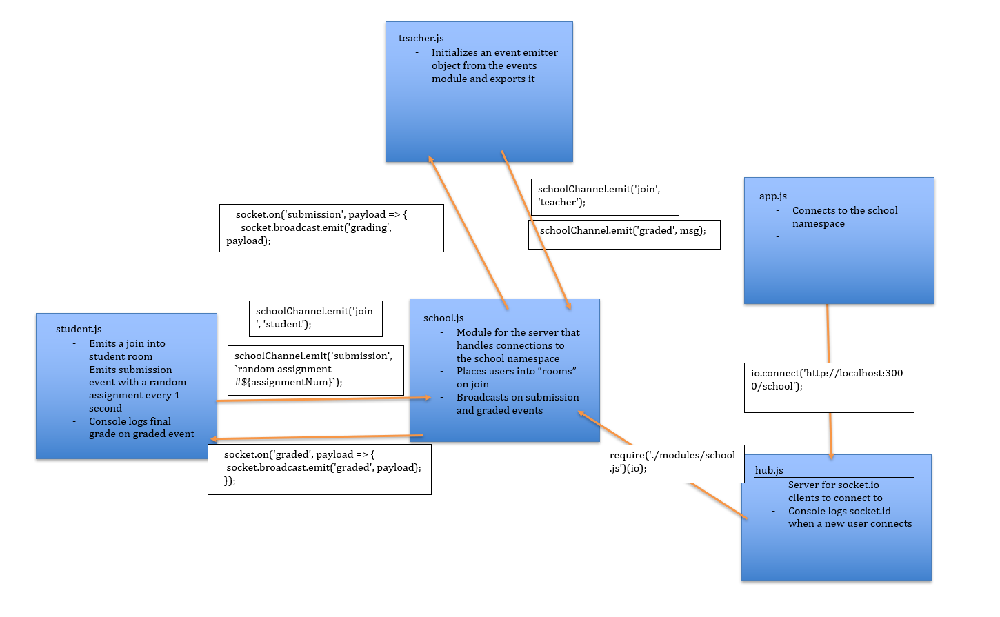

# LAB: Socket.io (18)

## Create an event driven application that simulates the basic functionality of grading an assignment using 2 client applications connected to a server hub via Socket.io, using only events to trigger actions

### Author: Earl Jay Caoile

### Links and Resources

- [submission PR](https://github.com/js-401n15-eoc/lab-18/pull/1)
- [GitHub Actions](https://github.com/js-401n15-eoc/lab-18/actions)

#### Documentation

- [Socket.io Emit Cheatsheet](https://socket.io/docs/emit-cheatsheet/)

### Setup

- ensure node.js 12 is installed globally
- create a .env file in the root folder with the following: `PORT=3000`
- execute the following from the root directory: `npm i dotenv socket.io socket.io-client`
- open up several terminal windows (Git Bash on Windows) in this lab's directory
- start in the following order: `nodemon hub.js`, `nodemon app.js`, `nodemon student.js`, `nodemon teacher.js`

#### Tests

- Oops, no unit tests. Just need to run the app.

#### UML

